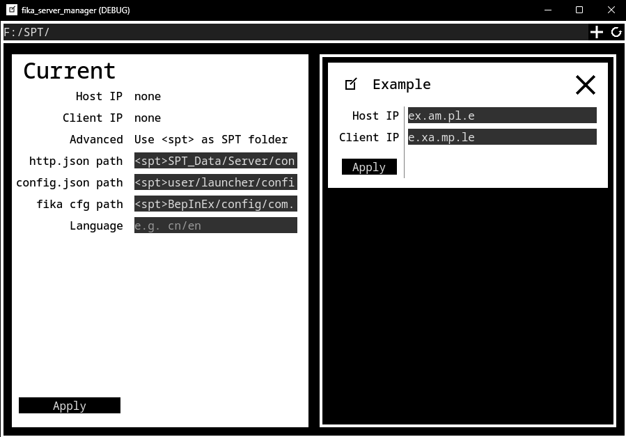

[简体中文](README_CN.md) 
[License](LICENSE) 
# fika_server_manager
 A helper application to smoothen your journey in FIKA

# How to use
 Extract the file into your spt-installation folder and launch `FSM.exe`. Other folder is also okay but requires a manual locate of spt-installation folder. 
 Click the + icon in upper right corner to add a server preset and clisk `apply` to literally apply it. 
 Then launch your SPT and enjoy. 
 To edit a preset, edit those in inputbox and press `Enter` to commit the change.

# Extras
 
 For default FSM detects where it runs as spt folder. However you can override it in top bar. AAAnd, also those files to tamper in left half. 
 FSM automatically saves backup for `http.json` and `config.json`, as `*.bak`.