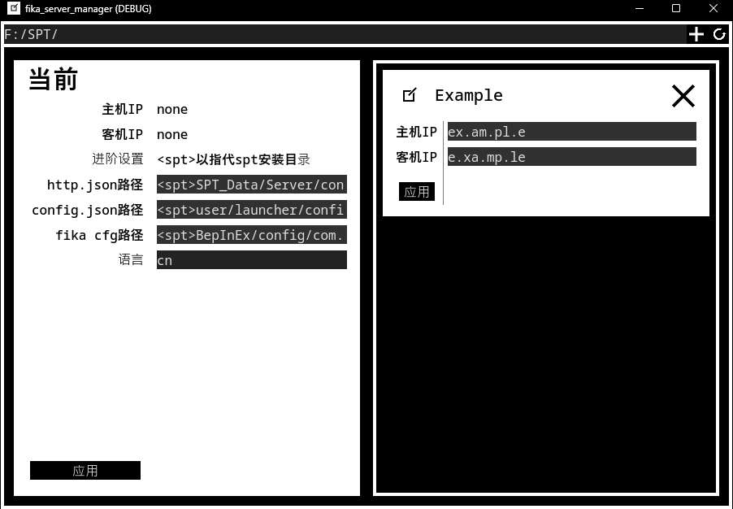

[English](README.md) 
[License](LICENSE) 
# fika_server_manager
 让FIKA使用体验更加丝滑的辅助app

# 如何使用
 将程序解压至SPT安装目录并启动`FSM.exe`，解压至其它目录同样可行，不过需要后续自行手动指定SPT安装目录。 
 点击右上角的加号`+`以添加预设，点击`应用`以应用预设。 
 成功应用预设后，手动启动你的SPT以进行游玩。 
 若需要编辑已有的预设，按回车`Enter`键以提交更改。

# Extras
 
 FSM默认采取其安装路径作为SPT安装目录，不过你可以在顶栏修改其检测的安装目录，需要修改的几个具体文件则在左侧输入框中进行更改. 
 `http.json`和`config.json`会自动备份为`*.bak`.